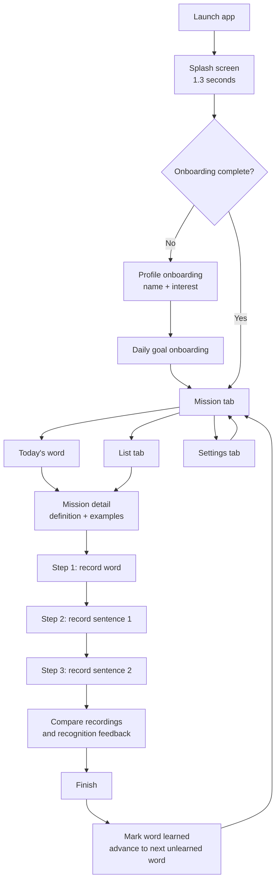
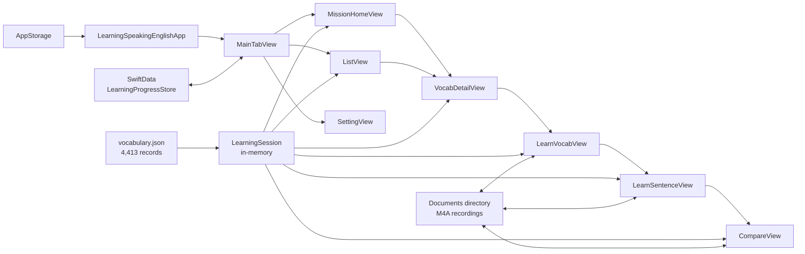

# Vocab.ly — Learning Speaking English

Vocab.ly is a native iOS vocabulary and speaking-practice app for Indonesian learners of English. It presents a daily vocabulary mission, provides contextual English–Indonesian examples, lets learners listen and record their pronunciation, and gives lightweight speech-recognition feedback.

The project is written entirely in Swift/SwiftUI. It uses Apple frameworks only: SwiftUI, SwiftData, AVFoundation, and Speech.

## Product summary

The app helps a learner practise one vocabulary item at a time through a three-step spoken exercise:

1. Listen to and record the vocabulary word.
2. Listen to and record the first contextual sentence.
3. Listen to and record the second contextual sentence.
4. Compare the reference audio with the learner's recordings, review recognition feedback, and finish the item.

Learners choose a name, a daily vocabulary target, and an interest area during onboarding. The interest selection controls the example sentences shown for every word:

- **General** — everyday usage.
- **Technology, Business, Marketing, Finance, Engineering, Creative** — domain-specific recommendations and examples.

The app bundles `LearningSpeakingEnglish/Resources/vocabulary.json` as its vocabulary source of truth. It contains **4,413 dictionary records** with CEFR level, frequency rank, domain labels, pronunciation, definitions, and original examples. The Mission and List tabs use this JSON source for frequency/domain/exploration recommendations.

The POC integration also bundles `LearningSpeakingEnglish/Resources/vocabulary.json`, containing 4,413 dictionary records with CEFR level, frequency rank, domain labels, pronunciation, definitions, and original examples. The Mission tab now uses this JSON source for frequency/domain/exploration recommendations; the original 99-item model remains available to the existing List and legacy learning views while the POC is evaluated.

## User flow



### Detailed learning flow

1. **Launch and routing**
   - `LearningSpeakingEnglishApp` shows `SplashView` for 1.3 seconds.
   - If `hasCompletedOnboarding` is false, the learner sees the two onboarding screens; otherwise, the main tab interface opens.

2. **Onboarding**
   - The first screen collects an optional name and one interest: General, Code, or Design.
   - The second screen sets the daily target. The UI can decrement to zero, but the saved target is clamped to at least one.
   - The app saves the profile in `UserDefaults` through `@AppStorage` and marks onboarding complete.

3. **Mission**
   - The Mission tab shows the current word, its IPA pronunciation, English meaning, current daily progress, and a Start Mission button.
   - Tapping the pronunciation control uses text-to-speech in US English.
   - Skip moves to the next item cyclically without marking the current item as learned.
   - Once the count of learned words reaches the daily target, the tab displays a completion banner. The learner may still continue practising.

4. **Word detail**
   - The detail screen shows the English word, Indonesian translation, word types, definitions, and the two examples matching the selected interest.
   - Word and example audio controls use system text-to-speech.
   - An already learned word also exposes the Compare screen, so its current in-memory recordings can be replayed/rechecked.

5. **Speaking exercise**
   - The learner records the word, then two example sentences.
   - Each recording uses AAC/M4A audio, mono, 12 kHz, saved in the app Documents directory with a UUID file name.
   - After stopping a recording, the app requests speech-recognition permission (if required), transcribes the local recording, and displays feedback.
   - The Next button is available after a recording is made; a positive recognition score is not required to continue.

6. **Comparison and completion**
   - The Compare screen plays either the reference speech or the learner recording for all three steps.
   - When it appears, it requests speech permission and analyzes the three saved recordings sequentially. Each section can also be checked again manually.
   - Finish marks the current vocabulary item as learned and advances the session to the next unlearned item.

7. **List and settings**
   - The List tab searches English and Indonesian vocabulary names and separates results into Learned and Need Practice sections, sorted alphabetically.
   - Opening any list row makes that word the current mission item.
   - Settings edits the name, interest, and daily target. Reset deletes persisted learning progress and returns the learner to onboarding.

## Pronunciation feedback

Speech recognition is handled by `PronunciationHelper` with an `en-US` recognizer. The app attempts on-device recognition when the device supports it and cancels a stalled recognition request after eight seconds.

This is text matching, not acoustic pronunciation scoring. The transcribed text and the expected text are normalized by lowercasing and trimming outer whitespace/punctuation, then classified as:

| Result | Rule |
| --- | --- |
| Great | Exact normalized match, or the transcript contains the target. |
| Almost | The transcript starts with the target's first three characters, or the target contains the transcript. |
| Keep trying | A non-empty transcript that does not meet the previous rules. |
| Unknown | Speech recognition is unavailable, denied, fails, times out, or produces empty text. |

The app does not block progress based on this result.

## Architecture

The project is a small single-target SwiftUI application. State is passed down through view bindings rather than view models or a networking layer.



### Main runtime models

| Type | Responsibility |
| --- | --- |
| `Vocab` | One bilingual vocabulary record plus General, Code, and Design examples. |
| `Example` | One English–Indonesian example-sentence pair. |
| `LearningSession` | In-memory current index, learned vocabulary UUIDs, selected interest, daily target, and recording URLs. |
| `LearningRecording` | URLs for the word, first-sentence, and second-sentence recordings of one word. |
| `LearningProgressStore` | SwiftData record that persists learned word names and the current word name. |
| `PronunciationResult` | Speech-recognition transcript and one of four display-score buckets. |

### Persistence

| Data | Mechanism | Survives relaunch? |
| --- | --- | --- |
| Onboarding completed, learner name, interest, daily target | `@AppStorage` / UserDefaults | Yes |
| Learned vocabulary and current vocabulary | One `LearningProgressStore` SwiftData record | Yes |
| Current `LearningSession` | SwiftUI `@State` | No; reconstructed at launch |
| Recording file URLs | In-memory `LearningSession` | No |
| M4A audio files | App Documents directory | Files remain, but are not rediscovered after relaunch |

The persisted progress maps vocabulary by English word name, not UUID. This works with the current fixed database and lets freshly created `Vocab` UUIDs be restored across launches.

## Project structure

```text
LearningSpeakingEnglish/
├── App/
│   └── LearningSpeakingEnglishApp.swift    # App entry, launch routing, SwiftData container
├── Model/
│   ├── Model.swift                         # Domain/session/feedback models
│   ├── LearningProgressStore.swift         # SwiftData persistence schema
│   └── RecommendedVocabulary.swift         # JSON records and ranking models
├── Helper/
│   ├── SpeechHelper.swift                  # Text-to-speech
│   ├── RecordingHelper.swift               # Permissions, recording, and playback
│   └── PronunciationHelper.swift           # Local-audio speech transcription and scoring
├── View/
│   ├── MainTabView.swift                   # Tab shell and progress restoration/persistence
│   ├── MissionHomeView.swift               # Daily mission dashboard
│   ├── ListView.swift                      # Searchable vocabulary list
│   ├── VocabDetailView.swift               # Word details and flow entry
│   ├── LearnVocabView.swift                # Step 1: word recording
│   ├── LearnSentenceView.swift             # Steps 2–3: sentence recordings
│   ├── CompareView.swift                   # Playback, checks, and completion
│   ├── SettingView.swift                   # Profile/goal edits and reset
│   ├── Onboarding1View.swift               # Name and interest
│   ├── Onboarding2View.swift               # Daily goal
│   ├── SplashView.swift                    # Launch screen
│   └── Components/                         # Progress and recording-sheet views
├── Extension/
│   └── Color+extension.swift               # App primary/secondary colors
├── Resources/
│   └── vocabulary.json                     # 4,413-record JSON vocabulary source
└── Assets.xcassets/                        # App icon, logo, illustration, colors
```

`Vocab` remains as a temporary compatibility projection for the older recording views; it is created from JSON at runtime. `ResultAlertView` exists in `View/RateView.swift`, but no current screen presents it. Likewise, the sorting menu UI in `ListView` is currently unused/commented out.

## Platform and configuration

- **Display name:** Vocab.ly
- **Bundle identifier:** `appldev.LearningSpeakingEnglish`
- **Version:** 1.0 (build 1)
- **Deployment target:** iOS 26.4
- **Device families:** iPhone and iPad
- **External dependencies:** none
- **Required permissions:** Microphone (recording practice) and Speech Recognition (transcribing practice recordings)

The Xcode project generates its Info.plist and includes the usage descriptions for both permissions in the target build settings.

## Build and run

1. Open [LearningSpeakingEnglish.xcodeproj](/Users/ariffathurrahman/Documents/coding/1.RiyalProject/LearningSpeakingEnglish/LearningSpeakingEnglish.xcodeproj) in Xcode.
2. Select the `LearningSpeakingEnglish` scheme and an iPhone/iPad simulator or physical device.
3. Build and run.
4. On a physical device, allow microphone and speech-recognition access to use the complete practice flow. Simulator behavior for speech recognition can vary by runtime and available services.

## Current behavior and limitations

- The vocabulary database is local and static; there is no API, login, sync, remote content management, or notification scheduling.
- “Daily” progress has no date/reset logic. Learned words persist indefinitely, so the daily count is a target cap over total learned items, not a calendar-day record.
- Existing recordings are not restored after an app relaunch because their URLs are only held in session memory. Their audio files are also not cleaned up.
- Skipping, opening an item from the List tab, or changing the current word is persisted; only learned state and the active word are stored in SwiftData.
- The speech result is a deliberately simple transcript comparison. It should be described as recognition feedback, not a precise pronunciation assessment.
- The app does not show a dedicated error message when microphone/speech permission is denied or recorder/recognizer setup fails; the recording action simply does not proceed.
- The learning flow assumes that every vocabulary item provides at least two examples for every interest, which the bundled database currently does.
- Some targets and UI APIs are very recent (the project target is iOS 26.4), so the app will not build for earlier iOS deployment targets without compatibility work.

## Suggested next development priorities

1. Add calendar-based daily progress and a reset/rollover strategy.
2. Persist recording metadata, provide recording deletion, and clean orphaned audio files.
3. Improve pronunciation assessment or clearly calibrate transcript-match feedback for users.
4. Add permission/error states and tests for session progression, persistence, and scoring.
5. Move the static vocabulary data into a maintainable content source if frequent updates are expected.
